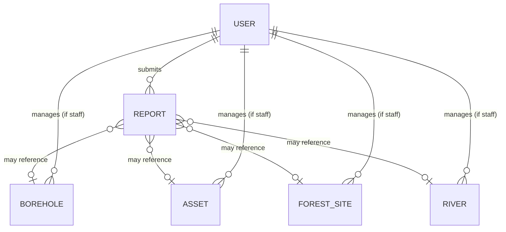

# Data Model (Draft)

**Status:** Draft — for design review, not final
**Last updated:** 2026-09-01

A first-pass entity list derived from [requirements.md](../planning/requirements.md) and [scope.md](../planning/scope.md), meant to seed detailed data modeling. Field lists are illustrative, not exhaustive or final.

## Core Entities

### Borehole
- id, name/label
- location (lat/lng)
- LGA (Local Government Area)
- status (functional / non-functional / needs maintenance)
- installation date, last maintenance date
- photos[]
- maintenance history[]

### Asset
- id, type (irrigation pump, equipment, etc.)
- location (lat/lng), LGA
- status
- photos[]
- maintenance history[]

### ForestSite
- id, name
- location / boundary (point or polygon)
- LGA
- type (forest / afforestation site)
- status / health indicator
- risk flags (from AI Prediction Engine)

### River
- id, name
- location / course (point or line)
- LGA
- source (`official` or `community_reported`)
- local name (for community-reported rivers)
- description, photos[]
- stress indicator (from AI Prediction Engine)

### Report
- id, type (problem report / small-river report)
- submitted_by (registered user id, or anonymous)
- related_entity (borehole/asset/forest/river id, if applicable)
- description, location (lat/lng), photos[]
- status (submitted / under review / verified / resolved / rejected)
- submitted_at, updated_at

### User
- id
- role (`public`, `registered_community`, `staff`, `admin`)
- name, contact info (registered/staff/admin only)
- created_at

## Relationships

## Notes

- `Report` is intentionally decoupled from the entity it concerns, since community members may report a problem with something not yet in the system (e.g. an unknown small river).
- Verification state on community-reported entities is a workflow concern as much as a data concern — see the related open question in [architecture/overview.md](overview.md).
