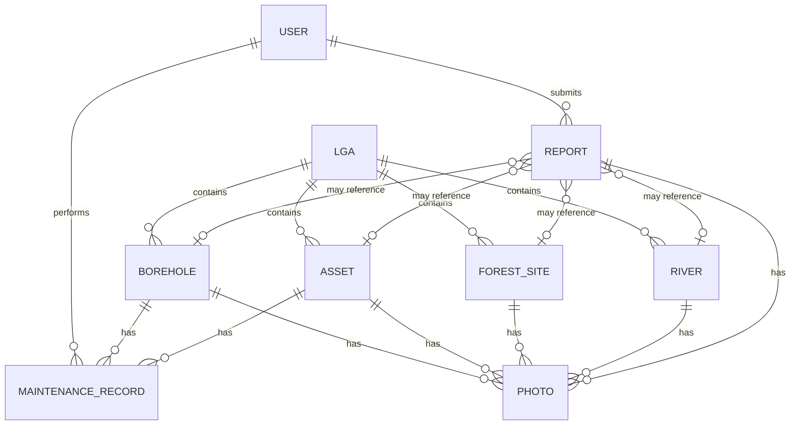

# Data Model

**Status:** Detailed Draft — ready for implementation review
**Last updated:** 2026-09-10

Expands the entity list from the first pass into concrete fields and a PostgreSQL/PostGIS schema, so it can be implemented directly if the team's chosen backend is Supabase or Node+Postgres (both accepted as options in [ADR-0002](decisions/0002-adopt-initial-technology-stack.md)). If Firebase is chosen instead, the entities and fields below still apply — just as documents/collections rather than tables, with geo-queries handled differently.

## Core Entities

### LGA (reference table)
- `code` (PK), `name`
- `pilot` — true for the 14 launch LGAs from [scope.md](../planning/scope.md), false for the 9 held back for a later phase

### User
- `id`, `role` (`registered_community` / `staff` / `admin` — unauthenticated "public" access has no row at all)
- `name`, `contact` (email or phone, unique)
- `created_at`, `deleted_at` — soft-delete so a self-deleted account (per [data-privacy.md](../planning/data-privacy.md)) doesn't break historical report references

### Borehole
- `id`, `name`, `lga_code`, `location` (point)
- `status` (`functional` / `non_functional` / `needs_maintenance`)
- `installation_date`, `last_maintenance_date`
- `created_by`, `created_at`, `updated_at`
- photos and maintenance history live in the shared `photos` and `maintenance_records` tables below

### Asset
- `id`, `type` (free text — e.g. irrigation pump, equipment — not an enum, so new asset types don't need a migration)
- `lga_code`, `location`, `status` — same shape as Borehole
- `created_by`, `created_at`, `updated_at`

### ForestSite
- `id`, `name`, `lga_code`
- `boundary` (point or polygon — some sites won't have a surveyed boundary yet)
- `type` (`forest` / `afforestation_site`), `status`
- `risk_flag` (`none`/`low`/`medium`/`high`) — written by the AI Prediction Engine, not user-editable
- `created_by`, `created_at`, `updated_at`

### River
- `id`, `name`, `lga_code`
- `course` (point or line)
- `source` (`official` / `community_reported`), `local_name`, `description`
- `stress_indicator` (`none`/`low`/`medium`/`high`) — written by the AI Prediction Engine
- `verified` — community-reported rivers default to `false` and stay off the public map until staff verify (see the open question in [overview.md](overview.md))
- `created_by`, `created_at`, `updated_at`

### Report
- `id`, `type` (`problem_report` / `small_river_report`)
- `submitted_by` (nullable — null means anonymous)
- `related_entity_type` / `related_entity_id` (nullable — a report can exist with no matching entity yet, e.g. an unknown river)
- `description`, `location`, `status` (`submitted`/`under_review`/`verified`/`resolved`/`rejected`)
- `submitted_at`, `updated_at`, `resolved_at`
- `anonymized_at` — set 2 years after `resolved_at`, per the retention rule in [data-privacy.md](../planning/data-privacy.md)

### MaintenanceRecord (shared by Borehole and Asset)
- `id`, `entity_type` (`borehole`/`asset`), `entity_id`
- `performed_at`, `notes`, `performed_by`

### Photo (shared by every entity that can carry photos)
- `id`, `entity_type` (`borehole`/`asset`/`forest_site`/`river`/`report`), `entity_id`
- `url`, `uploaded_at`

## Relationships


```mermaid
erDiagram
    LGA ||--o{ BOREHOLE : contains
    LGA ||--o{ ASSET : contains
    LGA ||--o{ FOREST_SITE : contains
    LGA ||--o{ RIVER : contains
    USER ||--o{ REPORT : submits
    USER ||--o{ MAINTENANCE_RECORD : performs
    REPORT }o--o| BOREHOLE : "may reference"
    REPORT }o--o| ASSET : "may reference"
    REPORT }o--o| FOREST_SITE : "may reference"
    REPORT }o--o| RIVER : "may reference"
    BOREHOLE ||--o{ MAINTENANCE_RECORD : has
    ASSET ||--o{ MAINTENANCE_RECORD : has
    BOREHOLE ||--o{ PHOTO : has
    ASSET ||--o{ PHOTO : has
    FOREST_SITE ||--o{ PHOTO : has
    RIVER ||--o{ PHOTO : has
    REPORT ||--o{ PHOTO : has
```

## Schema (PostgreSQL / PostGIS)

Illustrative DDL — the concrete syntax a Supabase or Node+Postgres implementation could start from.

```sql
-- CREATE EXTENSION IF NOT EXISTS postgis;

CREATE TABLE lgas (
    code        TEXT PRIMARY KEY,
    name        TEXT NOT NULL,
    pilot       BOOLEAN NOT NULL DEFAULT FALSE
);

CREATE TABLE users (
    id          UUID PRIMARY KEY DEFAULT gen_random_uuid(),
    role        TEXT NOT NULL CHECK (role IN ('registered_community','staff','admin')),
    name        TEXT,
    contact     TEXT UNIQUE,
    created_at  TIMESTAMPTZ NOT NULL DEFAULT now(),
    deleted_at  TIMESTAMPTZ
);

CREATE TABLE boreholes (
    id                    UUID PRIMARY KEY DEFAULT gen_random_uuid(),
    name                  TEXT NOT NULL,
    lga_code              TEXT NOT NULL REFERENCES lgas(code),
    location              GEOGRAPHY(POINT, 4326) NOT NULL,
    status                TEXT NOT NULL CHECK (status IN ('functional','non_functional','needs_maintenance')),
    installation_date     DATE,
    last_maintenance_date DATE,
    created_by            UUID REFERENCES users(id),
    created_at            TIMESTAMPTZ NOT NULL DEFAULT now(),
    updated_at            TIMESTAMPTZ NOT NULL DEFAULT now()
);

CREATE TABLE assets (
    id          UUID PRIMARY KEY DEFAULT gen_random_uuid(),
    type        TEXT NOT NULL,
    lga_code    TEXT NOT NULL REFERENCES lgas(code),
    location    GEOGRAPHY(POINT, 4326) NOT NULL,
    status      TEXT NOT NULL CHECK (status IN ('functional','non_functional','needs_maintenance')),
    created_by  UUID REFERENCES users(id),
    created_at  TIMESTAMPTZ NOT NULL DEFAULT now(),
    updated_at  TIMESTAMPTZ NOT NULL DEFAULT now()
);

CREATE TABLE forest_sites (
    id          UUID PRIMARY KEY DEFAULT gen_random_uuid(),
    name        TEXT NOT NULL,
    lga_code    TEXT NOT NULL REFERENCES lgas(code),
    type        TEXT NOT NULL CHECK (type IN ('forest','afforestation_site')),
    boundary    GEOGRAPHY(GEOMETRY, 4326) NOT NULL,
    status      TEXT,
    risk_flag   TEXT CHECK (risk_flag IN ('none','low','medium','high')),
    created_by  UUID REFERENCES users(id),
    created_at  TIMESTAMPTZ NOT NULL DEFAULT now(),
    updated_at  TIMESTAMPTZ NOT NULL DEFAULT now()
);

CREATE TABLE rivers (
    id                UUID PRIMARY KEY DEFAULT gen_random_uuid(),
    name              TEXT,
    lga_code          TEXT NOT NULL REFERENCES lgas(code),
    course            GEOGRAPHY(GEOMETRY, 4326) NOT NULL,
    source            TEXT NOT NULL CHECK (source IN ('official','community_reported')),
    local_name        TEXT,
    description       TEXT,
    stress_indicator  TEXT CHECK (stress_indicator IN ('none','low','medium','high')),
    verified          BOOLEAN NOT NULL DEFAULT FALSE,
    created_by        UUID REFERENCES users(id),
    created_at        TIMESTAMPTZ NOT NULL DEFAULT now(),
    updated_at        TIMESTAMPTZ NOT NULL DEFAULT now()
);

CREATE TABLE reports (
    id                   UUID PRIMARY KEY DEFAULT gen_random_uuid(),
    type                 TEXT NOT NULL CHECK (type IN ('problem_report','small_river_report')),
    submitted_by         UUID REFERENCES users(id),
    related_entity_type  TEXT CHECK (related_entity_type IN ('borehole','asset','forest_site','river')),
    related_entity_id    UUID,
    description          TEXT NOT NULL,
    location             GEOGRAPHY(POINT, 4326) NOT NULL,
    status               TEXT NOT NULL DEFAULT 'submitted'
                           CHECK (status IN ('submitted','under_review','verified','resolved','rejected')),
    submitted_at         TIMESTAMPTZ NOT NULL DEFAULT now(),
    updated_at           TIMESTAMPTZ NOT NULL DEFAULT now(),
    resolved_at          TIMESTAMPTZ,
    anonymized_at        TIMESTAMPTZ
);

CREATE TABLE maintenance_records (
    id            UUID PRIMARY KEY DEFAULT gen_random_uuid(),
    entity_type   TEXT NOT NULL CHECK (entity_type IN ('borehole','asset')),
    entity_id     UUID NOT NULL,
    performed_at  DATE NOT NULL,
    notes         TEXT,
    performed_by  UUID REFERENCES users(id)
);

CREATE TABLE photos (
    id           UUID PRIMARY KEY DEFAULT gen_random_uuid(),
    entity_type  TEXT NOT NULL CHECK (entity_type IN ('borehole','asset','forest_site','river','report')),
    entity_id    UUID NOT NULL,
    url          TEXT NOT NULL,
    uploaded_at  TIMESTAMPTZ NOT NULL DEFAULT now()
);

-- Spatial indexes, for map-viewport queries (NFR-03 performance)
CREATE INDEX idx_boreholes_location    ON boreholes    USING GIST (location);
CREATE INDEX idx_assets_location       ON assets       USING GIST (location);
CREATE INDEX idx_forest_sites_boundary ON forest_sites USING GIST (boundary);
CREATE INDEX idx_rivers_course         ON rivers       USING GIST (course);
CREATE INDEX idx_reports_location      ON reports      USING GIST (location);
```

## Notes

- `Report` stays decoupled from the entity it concerns, since a community member may report something not yet in the system (e.g. an unknown small river) — `related_entity_id` is nullable for exactly this case.
- `MaintenanceRecord` and `Photo` are shared, polymorphic tables (`entity_type` + `entity_id`) rather than one table per entity, to avoid duplicating the same two tables four times over.
- `River.verified` and the staff-verification workflow for community-reported entities is still an open design question — see [architecture/overview.md](overview.md).
- `Report.anonymized_at` and `User.deleted_at` are the concrete hooks for the retention rules in [data-privacy.md](../planning/data-privacy.md) — a scheduled job should set `anonymized_at` and null out identifying fields 2 years after `resolved_at`.
