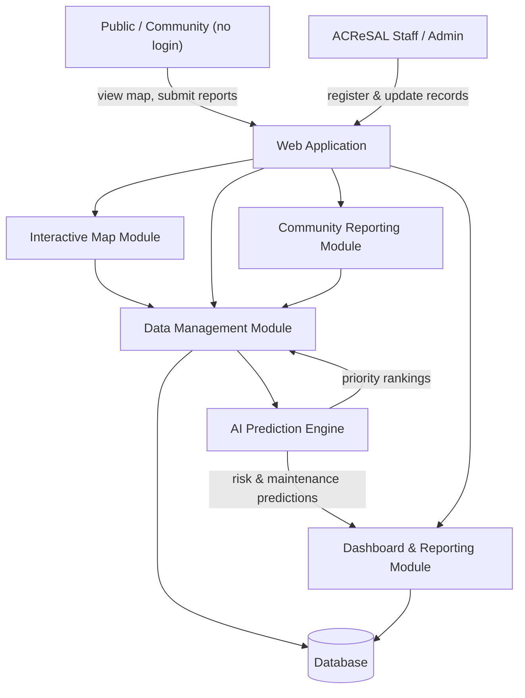

# Architecture Overview

**Status:** Proposed
**Last updated:** 2026-09-01

CARE-Map is organized around the six components introduced in the root README's [System Components](../../README.md#5-system-components) section. This document describes how they fit together. Nothing here is implemented yet — it's the target shape informing detailed design.

## Components

1. **Web Application** — staff and public-facing interface, built as one app with role-based views (public read-only map/reporting vs. authenticated staff/admin tooling).
2. **Interactive Map Module** — renders boreholes, assets, forests, and rivers on a map; supports filtering, search, and eventually offline caching of tiles/data.
3. **Data Management Module** — create/edit/validation for all tracked entities; the system of record for status and maintenance history.
4. **Community Reporting Module** — intake for problem reports and small-river reports from the public, optionally linked to a registered community account.
5. **AI Prediction Engine** — starts as rule-based logic over the tracked data (maintenance due dates, risk heuristics) and can incorporate simple ML models as data volume grows.
6. **Dashboard & Reporting Module** — aggregates data for summary statistics, exports, and management-facing analytics.

## High-Level Data Flow

## Design Principles

- **Public data is read-heavy and login-free.** The map and viewing of interventions must work without an account (NFR-02 in [requirements.md](../planning/requirements.md)).
- **Staff data changes are the authoritative source.** Community reports feed into the Data Management Module as proposed/unverified entries rather than directly overwriting staff-managed records — verification is a staff responsibility per the README's user roles.
- **AI starts simple.** The AI Prediction Engine is designed to run as rule-based logic first, so Phase 3 doesn't block on a trained model or a large dataset — see [roadmap.md](../planning/roadmap.md).
- **Mobile-first.** All modules are designed for mobile-friendly usage given the target users (NFR-01).

## Open Design Questions

- [ ] Does the AI Prediction Engine run synchronously (on request) or as a scheduled batch job?
- [ ] What's the review workflow for staff to verify community-submitted reports before they affect the public map?
- [ ] What's the approach to map tile hosting/caching for low-connectivity areas?
