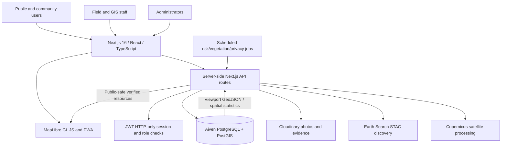

# CARE-Map Architecture Overview

**Status:** Implemented application architecture; production deployment and field verification pending  
**Updated:** 2026-10-09  
**Authority:** [ADR-0003](decisions/0003-adopt-aiven-postgis-nextjs.md) supersedes the exploratory stack in ADR-0002.

## Purpose and boundaries
CARE-Map is the Benue ACReSAL geospatial operations platform for tracking interventions, boreholes, infrastructure assets, forests, rivers, settlements, hazard areas, and catchments, with field reports and satellite vegetation observations. It is not a replacement for QGIS/ArcGIS or an independently certified hazard prediction system.

## Runtime architecture

```mermaid
flowchart TD
  P[Public and community users] --> W[Next.js 16 / React / TypeScript]
  S[Field and GIS staff] --> W
  A[Administrators] --> W
  W --> M[MapLibre GL JS and PWA]
  W --> API[Server-side Next.js API routes]
  API --> AUTH[JWT HTTP-only session and role checks]
  API --> PG[(Aiven PostgreSQL + PostGIS)]
  API --> B[Cloudinary photos and evidence]
  API --> ES[Earth Search STAC discovery]
  API --> C[Copernicus satellite processing]
  JOB[Scheduled risk/vegetation/privacy jobs] --> API
  PG -->|Viewport GeoJSON / spatial statistics| API
  API -->|Public-safe verified resources| M
```

## Major application modules
1. **Public:** viewport-bounded map and resource pages; intervention layers, LGA filters, anonymous problem/stream reports, QR scan-to-report, optional community identity, public-safe history, offline report queue, privacy rights and reviewed localization.
2. **Field operations:** GPS or manual coordinate capture, inspections and accuracy metadata, asset status, maintenance, photographic evidence, work assignment, deadlines and immutable status timeline.
3. **GIS workbench:** audited CSV/GeoJSON import with previews and row errors, quality/duplicate checks, approved administrative boundaries, GeoJSON exports for QGIS/ArcGIS, map composition.
4. **Spatial analysis:** indexed PostGIS distance and bounding-box operations; intervention coverage; settlement-to-functional-borehole access; verified river corridor, hazard-zone and catchment exposure; LGA aggregates.
5. **Remote sensing:** Sentinel-2 Level-2A discovery, AOI selection, NDVI baseline/comparison with cloud/clear-pixel gates, recurring monitors, vegetation-loss alerts and linked field verification tasks.
6. **Operations and governance:** explainable rule-based priority scores, dashboards, audit logs, users/roles, migrations and readiness checks, privacy request/breach registers, translation approval and per-device/LGA acceptance evidence.

## Data and trust boundaries
- **System of record:** Aiven PostgreSQL/PostGIS; new photos and evidence reside in Cloudinary (historical Blob URLs remain referenced), with metadata/reference records in PostgreSQL.
- **Geospatial format:** geographic coordinates use WGS84 (EPSG:4326); GeoJSON is longitude then latitude. Spatial indexes support area/distance queries; use geography/metre calculations where appropriate.
- **Public reporting:** community submissions are unverified until reviewed by authorized staff. Never treat a report as an authoritative asset, verified river, or hazard polygon without approval.
- **Public API:** exposes only explicitly approved/public-safe data. Database credentials and signed session secrets remain server-only.
- **Auth:** application-managed JWT in HTTP-only cookies; registered community, staff, admin roles; role/account changes revoke sessions.
- **Offline:** report queue/service-worker shell are implemented; comprehensive offline basemap packs and full staff-edit synchronization are **not** claimed.
- **Risk:** rule-based scoring, **not** a trained or scientifically validated ML model. Satellite-derived vegetation loss needs qualified review and ground truth.

## Deployment and operations
Vercel hosts the web app/API, Aiven provides PostgreSQL with PostGIS, Cloudinary holds new images. Migrations 001–015 are run with `npm run db:migrate` and checksummed in `care_map_schema_migrations`. Scheduled operations require configured credentials. Environment: `DATABASE_URL`, `AIVEN_CA_CERT`, `SESSION_SECRET`, `CRON_SECRET`, administrator bootstrap; Cloudinary and optional Copernicus credentials.

## Verification and remaining launch gates
Source implementation exists, **not** proof that the client's production environment is configured. Before handover: provision live Aiven/Vercel services; verify TLS, migrations and PostGIS; import validated pilot-LGA and intervention datasets; complete legal/privacy review; run CI and performance/security checks; run real-device/offline/GPS UAT and get written client sign-off.

## Related controlled documents
- [Requirements / SRS](../planning/requirements.md)
- [Deployment and operations guide](../client-handover/deployment-operations.md)
- [User manual](../client-handover/user-manual.md)
- [Acceptance and support plan](../client-handover/acceptance-support.md)
- [Production readiness](../production-readiness.md)
- [ADR-0003](decisions/0003-adopt-aiven-postgis-nextjs.md)
