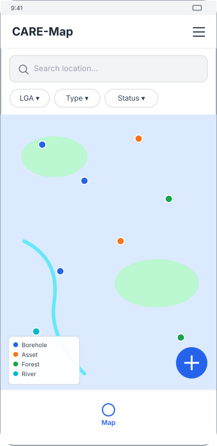
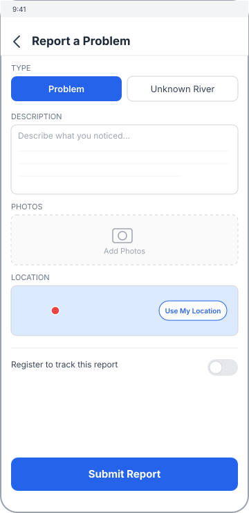
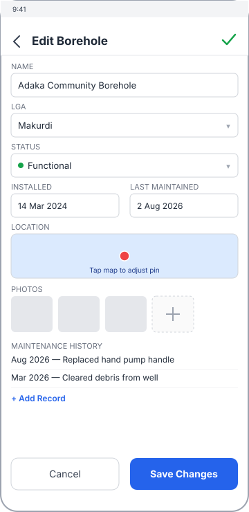
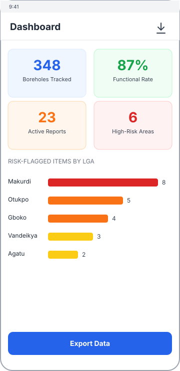

# Design

**Status:** Detailed Draft — low-fidelity wireframes for layout/flow review, not visual design
**Last updated:** 2026-09-10

Four wireframes covering the primary screen for each user role in [requirements.md](../planning/requirements.md). These are deliberately low-fidelity — grayscale boxes and one accent color — so review focuses on layout and information hierarchy, not colors or branding. All are mobile viewports (360×740) per NFR-01 (mobile-first).

## Public Map View

Landing experience for unauthenticated public/community users (FR-06, FR-07). Map-first, with LGA/type/status filters (FR-05) and a floating action button into the report flow.

## Report Submission

The one fully public write flow (FR-08, FR-09) — problem reports and unknown small-river reports share this form, switched by the type toggle at the top. The "register to track" toggle is the optional path into FR-10.

## Staff Data Entry (Edit Borehole)

Represents the staff CRUD screens (FR-01–FR-03); asset, forest site, and river edit screens follow the same shape with different fields, per [data-model.md](../architecture/data-model.md). Maintenance history and photos are inline rather than separate screens.

## Dashboard

Staff-facing summary view (FR-16–FR-18): totals, functional rate, and a risk breakdown by LGA feeding off the AI Prediction Engine's output (FR-15).

## Not Covered Yet

- Community registration / login screens
- Staff review queue for verifying community reports and small-river submissions (ties to the open workflow question in [architecture/overview.md](../architecture/overview.md))
- Admin user-management screens (FR-22)

These were left out of this first pass to keep it to the four highest-value screens; worth a follow-up pass once the core flow above gets feedback.
